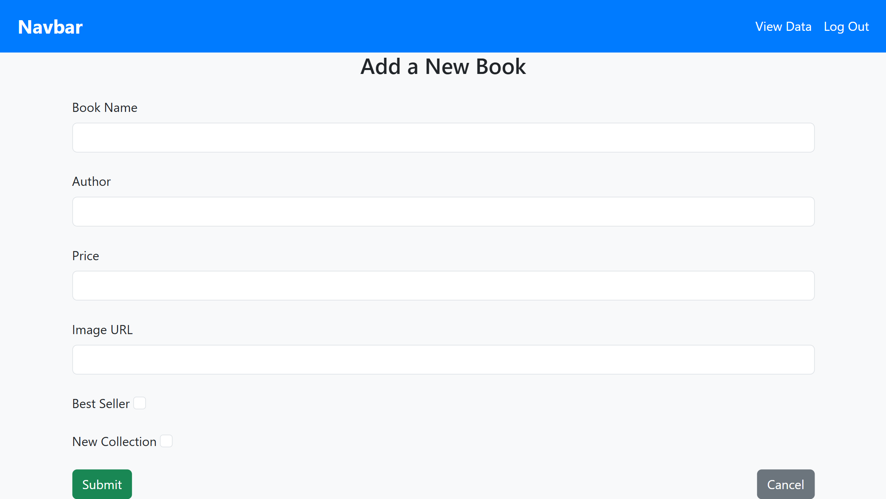

# PR-5-BookApplication

Book Management System

Description

This project is a Book Management System built using Node.js, Express.js, MongoDB, and EJS. It allows administrators to manage books, including adding, editing, and deleting books, and displaying them on a website.

Client Side: User-facing interface for browsing and purchasing books.

Admin Side: Management dashboard for book inventory, orders, and users.

1. Client Side

User registration and authentication

Search books by title, author, or genre

Add books to cart and checkout

2. Admin Side

Admin login and authentication

Add, update, and delete books

Features

- Admin Authentication (Simple hardcoded login credentials)

- View Books (Best Sellers & New Collections)

- Add New Books

- Edit Book Details

- Delete Books

- Book List Display

EJS Templating for Dynamic Rendering

Tech Stack

Backend: Node.js, Express.js

Frontend: EJS (Embedded JavaScript)

Database: MongoDB (Mongoose for Schema Modeling)

Styling: CSS, Static Files

Installation

Prerequisites:

Make sure you have the following installed:

- Node.js

- MongoDB

Project Structure

📦 book-management-system
 ┣ 📂 models
 ┃ ┣ 📜 adminSchema.js
 ┃ ┣ 📜 bookSchema.js
 ┣ 📂 configs
 ┃ ┣ 📜 database.js
 ┣ 📂 public
 ┣ 📂 views
 ┃ ┣ 📜 index.ejs
 ┃ ┣ 📜 login.ejs
 ┃ ┣ 📜 book.ejs
 ┃ ┣ 📜 edit.ejs
 ┃ ┣ 📜 data.ejs
 ┣ 📜 app.js
 ┣ 📜 package.json

1. Login Page :

2.Book form :

3.Book Data :

4.Edit Page :
.png>)

5.Home Page :
